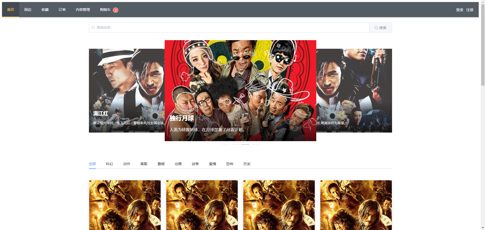
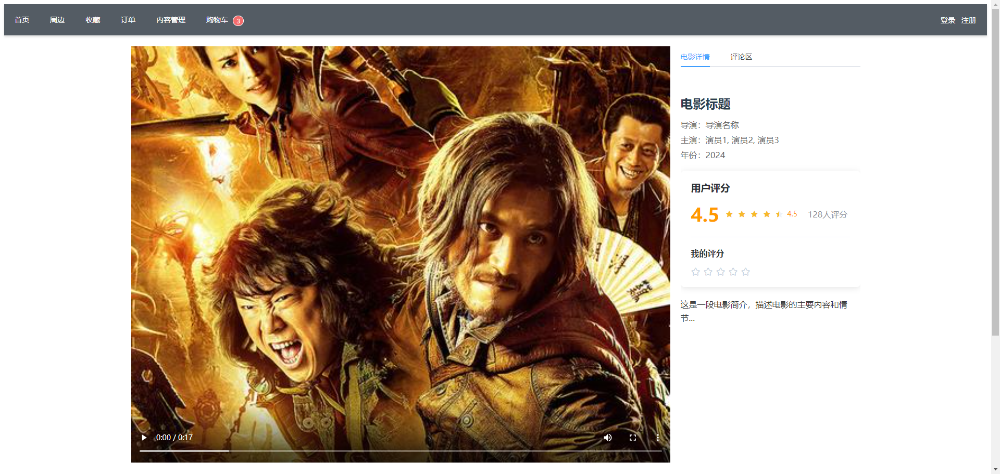
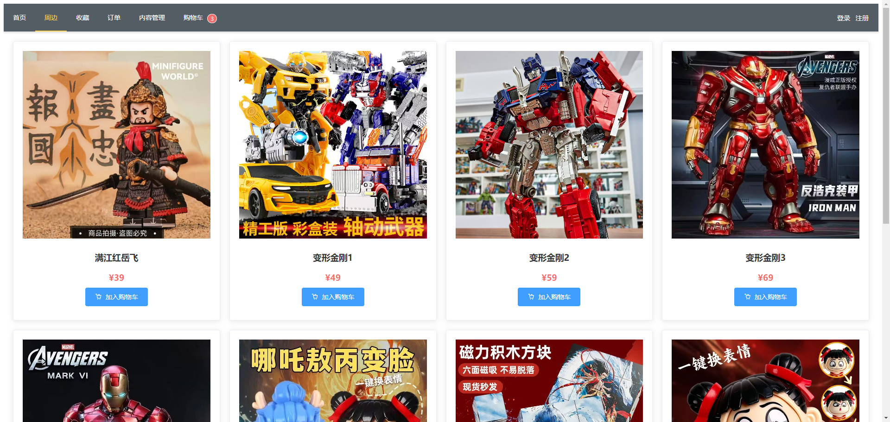
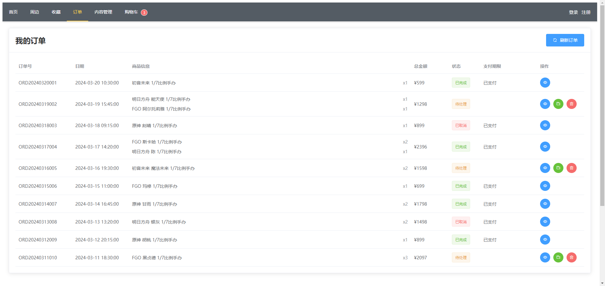
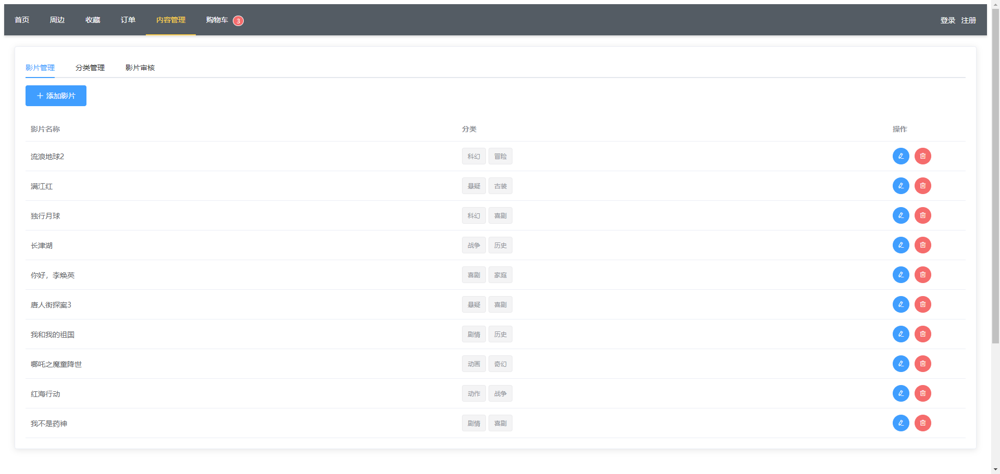
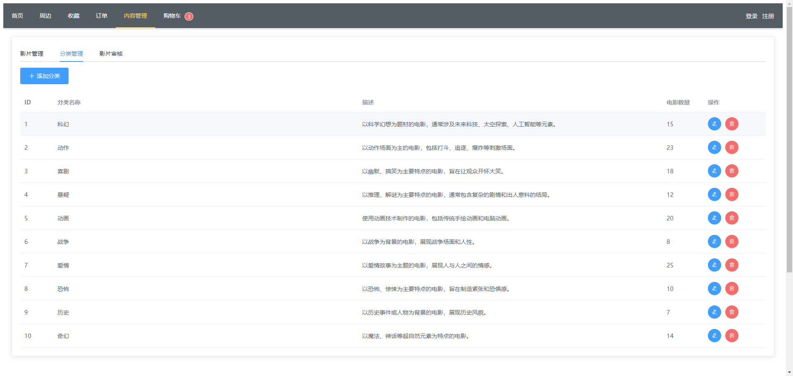
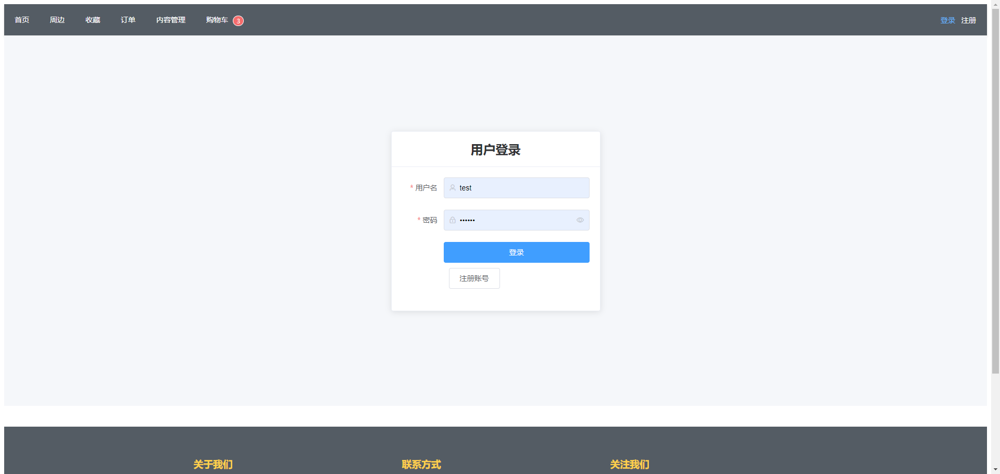
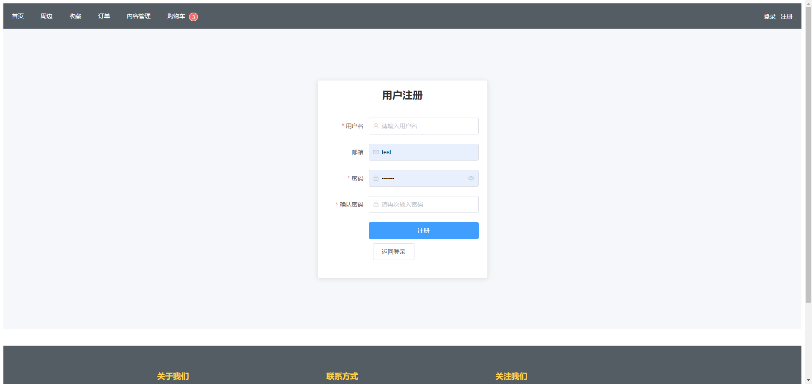

# 影视商城系统

这是一个基于 Vue.js 和 Node.js 开发的影视商城系统，提供电影展示、分类浏览、搜索等功能。

## 技术栈

### 前端

- Vue.js 2.6
- Element UI 2.15
- Vuex 3.4
- Vue Router 3.2
- Axios
- Video.js

### 后端

- Node.js
- Express
- MySQL

## 功能特点

- 响应式设计，支持多种设备访问
- 电影分类浏览
- 电影搜索功能
- 轮播图展示热门电影
- 电影详情展示
- 评分系统

## 效果图展示

### 首页展示



### 电影详情页



### 周边商品



### 管理后台





### 用户登录注册




## 项目结构

```
├── front-end/          # 前端项目目录
│   ├── src/           # 源代码
│   ├── public/        # 静态资源
│   └── package.json   # 前端依赖配置
│
├── movie/             # 后端项目目录
│   ├── routes/        # 路由配置
│   ├── service/       # 业务逻辑
│   ├── dao/          # 数据访问层
│   ├── util/         # 工具函数
│   └── uploads/      # 文件上传目录
│
└── movie05141643.sql  # 数据库初始化脚本
```

## 安装说明

### 前端安装

```bash
# 进入前端项目目录
cd front-end

# 安装依赖
npm install

# 启动开发服务器
npm run serve

# 构建生产版本
npm run build
```

### 后端安装

```bash
# 进入后端项目目录
cd movie

# 安装依赖
npm install

# 启动服务器
npm start
```

### 数据库配置

1. 创建 MySQL 数据库
2. 导入 `movie05141643.sql` 文件
3. 在 `movie/config` 目录下配置数据库连接信息

## 使用说明

1. 确保 MySQL 服务已启动
2. 启动后端服务
3. 启动前端开发服务器
4. 访问 `http://localhost:8080` 即可使用系统
